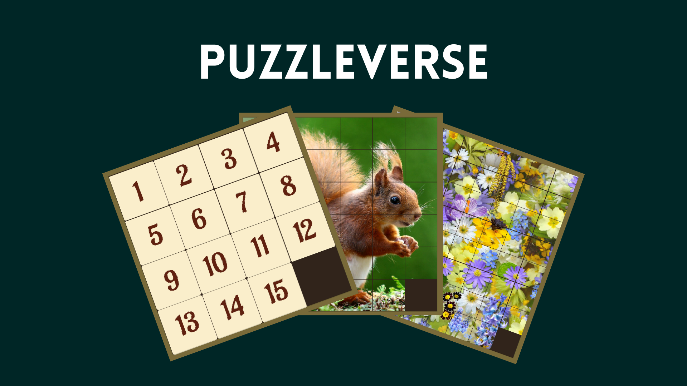

# PuzzleVerse

## Game Overview for PuzzleVerse

PuzzleVerse is a captivating puzzle game built with Unity 2D, designed to challenge players with a series of intricate and visually engaging puzzles. The game features three distinct levels, each progressively increasing in complexity to test the player's logic, problem-solving skills, and creativity. PuzzleVerse offers an immersive experience where every solved puzzle unlocks new challenges, rewarding the player with a sense of accomplishment and intellectual growth.

## Game Description

Embark on a journey through PuzzleVerse, a world filled with intriguing puzzles designed to sharpen your mind. With each level offering unique challenges, you'll face a variety of number-based and image slider puzzles that will push your cognitive limits.

* **Level 1:** Begin with a 4x4 number puzzle, designed to ease you into the mechanics of the game.
* **Level 2:** Progress to a 6x6 image puzzle, where you'll need to use strategy and spatial reasoning to rearrange picture tiles.
* **Level 3:** Face the ultimate challenge with an 8x8 image puzzle, designed to test your mastery of logic and attention to detail. 

As you advance through each level, the complexity grows, ensuring that no two puzzles are the same. PuzzleVerse combines engaging gameplay with visually appealing designs, creating a fun and thought-provoking experience for puzzle enthusiasts. 

## Key Features

* **Increasing Difficulty:**
Each level introduces a higher degree of complexity, challenging players' memory, logical thinking, and spatial awareness.

* **Visually Engaging Design:**
PuzzleVerse boasts clean and visually appealing graphics to keep players immersed. The image puzzles feature beautiful designs that add visual variety and aesthetic appeal to the gameplay.

* **Intuitive Controls:**
Simple drag-and-drop mechanics make PuzzleVerse accessible to players of all skill levels, ensuring ease of play while keeping the challenge intact.

* **Progressive Unlocking of Levels:**
Players must complete one level to unlock the next, creating a sense of progression and achievement as they advance.

* **Cognitive Benefits:**
PuzzleVerse is not only fun but also helps improve cognitive skills like problem-solving, memory, and attention to detail. It offers a mentally stimulating experience for players who enjoy puzzles.

## Gameplay Mechanics
### 1. Level 1: 4x4 Number Puzzle

* **Objective:** Arrange the scrambled numbered tiles in sequential order (1 through 15) within a 4x4 grid. Players slide tiles into an empty space to reorganize them until all numbers are in their correct positions.
* **Core Mechanics:** Players must slide adjacent tiles into the empty space using drag-and-drop mechanics.

### 2. Level 2: 6x6 Image Puzzle
* **Objective:** Rearrange the shuffled tiles of an image to restore the original picture. Players can move the image tiles into the empty space one at a time.
* **Core Mechanics:** Similar to the number puzzle, but this time players are required to remember the full image and strategize to put all tiles in their correct positions.

### 3. Level 3: 8x8 Image Puzzle
* **Objective:** Complete a complex 8x8 sliding image puzzle. The increased number of tiles makes the puzzle much harder, requiring attention to detail and excellent memory recall.
* **Core Mechanics:** The challenge here is greater precision, as the 8x8 grid leaves little room for error, and players must plan their moves carefully.

## Why Play PuzzleVerse?
PuzzleVerse is the perfect game for puzzle enthusiasts looking to challenge themselves with progressively difficult levels. Whether you are a casual player wanting to unwind with some simple puzzles or a hardcore puzzler looking for a mental workout, PuzzleVerse delivers a satisfying experience that sharpens both your mind and reflexes.
